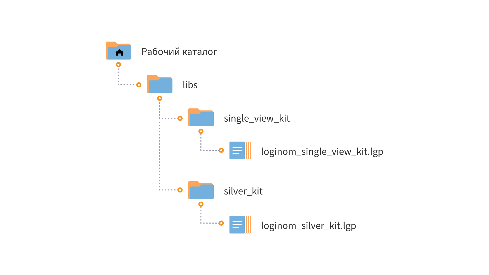

# Loginom Single View Kit CE

* Версия: 2.0.1
* Проверено: Loginom CE 6.5.1

Компоненты библиотеки **Loginom Single View Kit CE** предназначены для формирования профиля клиента с целью дальнейшей аналитической обработки и позволяют рассчитать:

* общие агрегаты по клиенту (сумма, количество транзакций и др.);
* агрегаты по неким группам (группам товаров, MCC-категориям и др.);
* агрегаты для банковских карточных транзакций по типам операций (покупка, снятие наличных, перевод и др.);
* агрегаты для ритейла (число позиций в транзакции, разнообразие позиций и др.).

Расчет может проводиться как на конкретную дату, так и в динамике: на конец текущего периода за N предыдущих.

Компоненты находятся в пакете **loginom_single_view_kit.lgp**

# Установка и настройка

## Требования

Для работы  библиотеки **Loginom Single View Kit CE** необходимо:

* Loginom Community Edition. Коммерческие версии Loginom не поддерживаются;

* Библиотека **Loginom Silver Kit** ([скачать на GitHub](https://github.com/loginom/loginom-silver-kit)). Версия не ниже 2.0.0.

## Порядок установки

1. Определите рабочий каталог, где будут расположены ваши библиотеки на локальном диске.
2. Создайте в нем подкаталог **customer_intelligence_pack**.
3. Разместите папку **single_view_kit** в каталоге **customer_intelligence_pack**.
4. Убедитесь, что библиотека **Loginom Silver Kit** находится в корне рабочего каталога в папке **silver_kit**.

